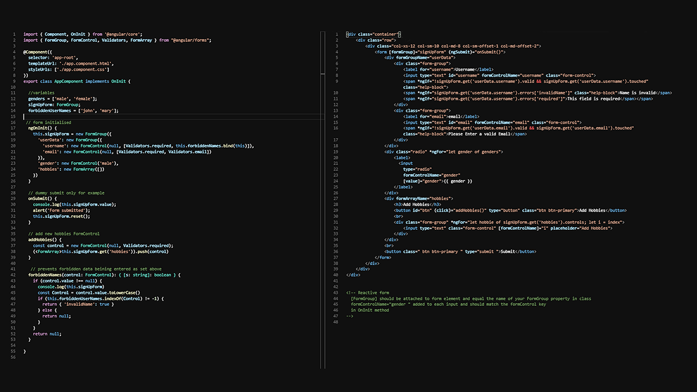
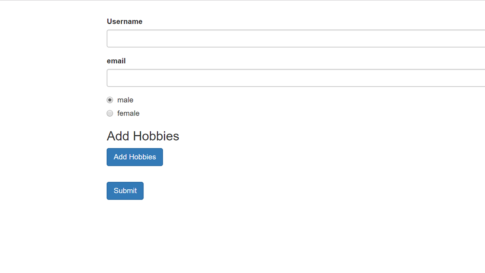

# Angular Reactive Form Example

```
> git clone https://github.com/jwill9999/angular4-reactiveforms.git
> cd into file  angular4-reactiveforms
> npm install
> ng serve
```

## Project Preview 





## Links

> [Angular docs Reactive Forms](https://angular.io/docs/ts/latest/guide/reactive-forms.html)

>[Tutorial Model Driven Forms](https://scotch.io/tutorials/using-angular-2s-model-driven-forms-with-formgroup-and-formcontrol)

> [Validation examples](https://www.javascripttuts.com/angular-2-reactive-forms-validations/)
